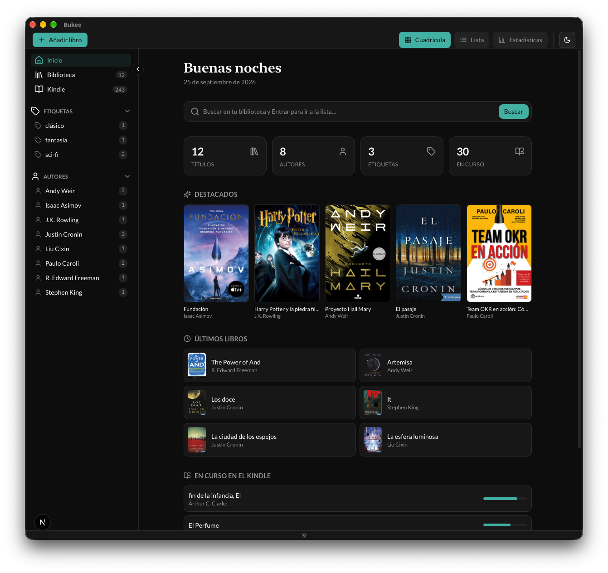
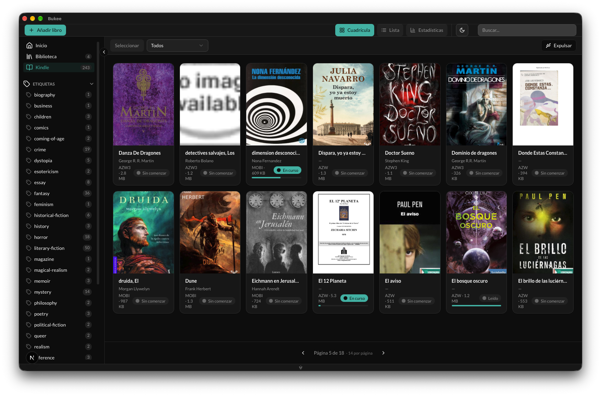

# Bukee

**Bukee** es una aplicación de escritorio moderna y multiplataforma para gestionar tu biblioteca personal de libros electrónicos. Construida con **Tauri 2**, **Next.js** y **Tailwind CSS**, ofrece una experiencia de usuario fluida, elegante y nativa, pensada también para trabajar con un **Kindle** conectado.

---



---

## ✨ Características

- **Dashboard de inicio**: vista de bienvenida con métricas de la biblioteca, libros destacados, últimos agregados, libros en curso (ordenados de más a menos leído) y búsqueda directa.
- **Gestión de Biblioteca**: organiza tus libros con facilidad, con la capacidad de editar y eliminar títulos.
- **Añadir Libros con Drag-and-Drop**: arrastra y suelta archivos EPUB para añadirlos a tu biblioteca.
- **Extracción de Metadatos**: Bukee extrae automáticamente metadatos de tus EPUBs, incluyendo título, autor, portada, descripción e identificador (ISBN).
- **Búsqueda y Filtrado**: encuentra libros rápidamente por título, o filtra por etiquetas y autores desde el sidebar.
- **Sidebar Colapsable**: expande o colapsa el sidebar para ganar espacio; las secciones de etiquetas y autores se pliegan por separado.
- **Vistas Flexibles**: alterna entre vista de cuadrícula (Grid) visual y una lista (List) detallada.
- **Estadísticas**: panel lateral con gráficos de títulos por etiqueta y por autor.
- **Kindle integrado**: al conectar un Kindle, muestra su biblioteca con estados de lectura (en curso, leído, sin comenzar), progreso, etiquetas y expulsión segura.
- **Paginado Dinámico**: los elementos por página se calculan según el tamaño de la ventana y el estado del sidebar, manteniendo cuadrícula y paginación siempre coherentes.
- **Modo Oscuro/Claro**: soporte nativo para temas claro y oscuro, adaptable a tu sistema.
- **Rendimiento Nativo**: gracias a Tauri y Rust, la aplicación es ligera y rápida.

---

## Tech Stack

| Capa              | Tecnología                                   |
| ----------------- | -------------------------------------------- |
| Runtime           | [Tauri 2](https://tauri.app)                 |
| Frontend          | [Next.js](https://nextjs.org) (App Router)   |
| UI                | [React 19](https://react.dev)                |
| Estilos           | [Tailwind CSS](https://tailwindcss.com) v4   |
| Componentes       | [Shadcn UI](https://ui.shadcn.com)           |
| Animaciones       | [Framer Motion](https://www.framer.com/motion/) |
| Gráficos          | [Recharts](https://recharts.org)             |
| Backend           | Rust                                         |
| Base de Datos     | SQLite (`tauri-plugin-sql`)                  |
| Tooling           | [Bun](https://bun.sh)                        |
| Lenguajes         | TypeScript + Rust                            |

---

## Configuración y Ejecución

### Prerrequisitos

Asegúrate de tener instalado lo siguiente:

1.  **Rust & Cargo** (necesario para Tauri).
2.  **Bun** (gestor de paquetes y runtime de JS).
3.  **Dependencias de desarrollo del sistema** (consulta la [guía de Tauri](https://tauri.app/start/prerequisites) para tu sistema operativo).

### Pasos para ejecutar

1.  **Clona el repositorio:**
    ```bash
    git clone https://github.com/tu-usuario/bukee.git
    cd bukee
    ```

2.  **Instala las dependencias:**
    ```bash
    bun install
    ```
    *Nota: Si es la primera vez, es posible que necesites borrar el archivo `bukee.db` del directorio de datos de la aplicación para que las migraciones se apliquen correctamente.*

3.  **Ejecuta en modo desarrollo:**
    ```bash
    bun run tauri dev
    ```
    Esto iniciará tanto el servidor de Next.js como la ventana de la aplicación Tauri.

---

## Construir para Producción

Para generar el ejecutable de la aplicación para tu plataforma:

```bash
bun run tauri build
```

El ejecutable se generará en `src-tauri/target/release/bundle/`.

---

## Estructura del Proyecto

```
.
├── app/                  # Código fuente de Next.js (Frontend)
│   ├── layout.tsx        # Layout principal de la aplicación
│   ├── page.tsx          # Página principal y lógica de la UI
│   └── globals.css       # Estilos globales y tokens de Tailwind v4
├── components/           # Componentes de UI reutilizables
│   └── ui/               # Componentes base de Shadcn
├── hooks/                # Hooks personalizados (useBooks, useKindle)
├── lib/                  # Librerías y utilidades (db, epub, tauri)
├── public/               # Archivos estáticos (imágenes, portadas, epub)
├── src-tauri/            # Backend de Tauri (Rust)
│   ├── src/
│   │   ├── lib.rs        # Lógica principal del backend en Rust
│   │   └── main.rs       # Punto de entrada de la aplicación Rust
│   └── tauri.conf.json   # Configuración de la aplicación Tauri
└── types/                # Definiciones de tipos (Book, KindleBook)
```

---
## Capturas

| Inicio (Dashboard) | Kindle |
| --- | --- |
|  |  |

---

## Licencia

Este proyecto está bajo la licencia MIT.